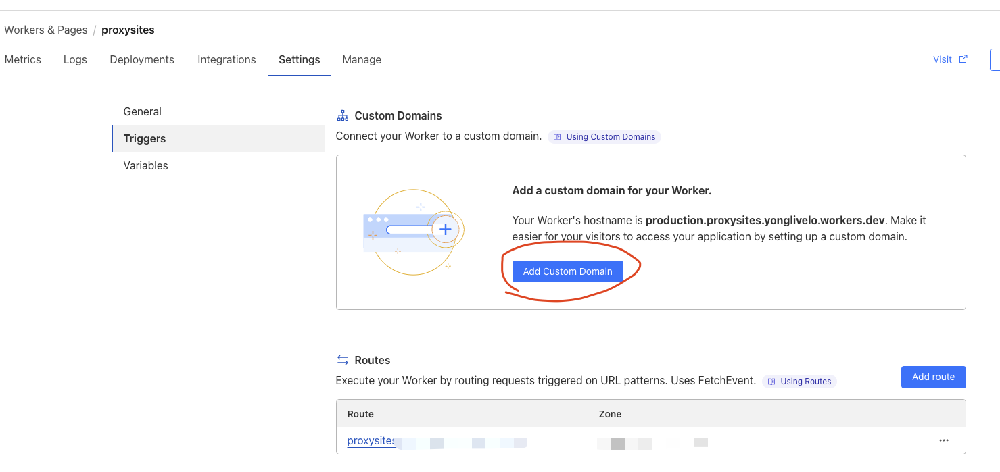

# Cloudflare Proxy Sites

A powerful and easy-to-use website mirroring tool based on Cloudflare Workers.

## 🌟 Key Features

- 🆓 Free to use
- 🌐 Mirror any website with ease
- 🚀 Quick deployment using Wrangler
- 🔗 Support for multiple domains
- 🤖 Automated deployment via GitHub Actions
- 🛡️ Enhanced privacy and security
- 🌍 Bypass geographical restrictions
- ⚡ Improved access spee

## Local Deploy 

### 1. install `wrangler`

```sh
npm i -g wrangler
```

### 2. Configure your root domain - **Important!**

Free domain name application:

- https://secure.nom.za/
- https://nic.eu.org/ 
- https://nic.ua

```js
// index.js
// replace to your domain
const currentDomain = "example.com";
```

#### Use workers.dev default domain?

This method only supports single domain reverse proxy.

Here is the code:

[workers.dev/index.js](workers.dev/index.js)

```js
// replace to your proxy site domain
const proxySite = 'example.com';
```

### 3. deploy to workers

```sh
# Login
wrangler login

# Deploy
wrangler deploy
```


## Or Deploy by Workflows

To automate your deployment process, you can use GitHub Actions or a similar CI/CD tool. Below are the steps to set up your deployment workflow and the necessary GitHub secrets:

### Configure GitHub Secrets

#### Add GitHub Secrets

Store sensitive information as secrets in your GitHub repository. Navigate to your repository settings and add the following secrets:

- **`CLOUDFLARE_API_TOKEN`**: Your Cloudflare **API token**. This token should have permissions to deploy and manage your Cloudflare Workers.
- **`CLOUDFLARE_ACCOUNT_ID`**: Your Cloudflare account ID.


#### To add secrets:

- Go to your repository on GitHub.
- Click on "Settings" in the top menu.
- Select "Secrets" from the sidebar.
- Click on "New repository secret" to add each secret.

## Manual Cloudflare Setup

For detailed instructions, see [this guide](https://github.com/gaboolic/cloudflare-reverse-proxy) (in Chinese). 

## Configure Workers for Proxy Site

eg. 

My root domain is `serp.ing`,

proxy sites [www.proxysites.ai](https://www.proxysites.ai), [www.serpchecking.com](https://www.serpchecking.com)

- <https://www.proxysites.ai.serp.ing/> 
- <https://www.serpchecking.com.serp.ing/>

### 1. Go Workers & Pages

Make sure you have deployed to Workers


### 2. Add a custom domain for your Worker.

Support multiple domain names, the following only set up a as an example




### 3. Done

Ensure the certificate is active.


## 🤖 robots.txt Configuration

Default configuration (recommended for privacy): 

```js
// index.js
const robots = `User-agent: *
Disallow: /
    `;
```

⚠️ **Warning**: Modifying this may affect the indexed content of the mirrored site.

## 📜 Disclaimer

This tool is for educational and personal use only. Users are responsible for complying with all applicable laws and regulations. The developers are not liable for any misuse or legal consequences.

## 🤝 Contributing

Contributions are welcome! Feel free to submit issues or pull requests.