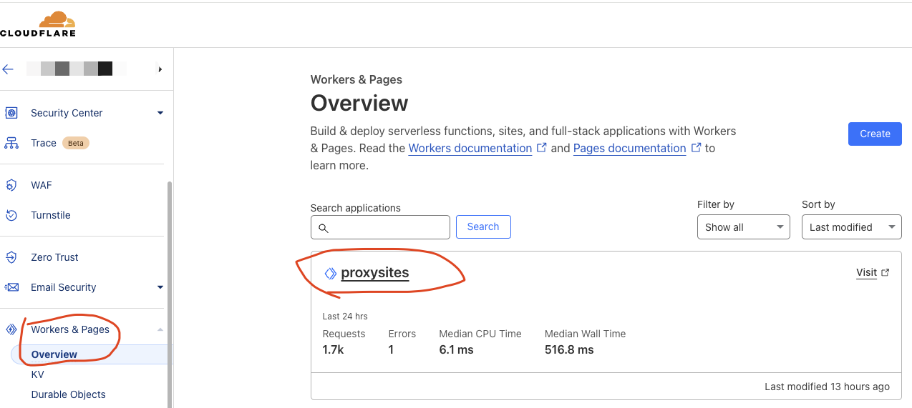

# Cloudflare Proxy Sites

A powerful and easy-to-use website mirroring tool based on Cloudflare Workers.

## Proxy Sites: Vercel Version

https://github.com/seadfeng/vercel-proxy-sites

## 🌟 Key Features

- 🆓 Free to use
- 🌐 Mirror any website with ease
- 🚀 Quick deployment using Wrangler
- 🔗 Support for multiple domains
- 🤖 Automated deployment via GitHub Actions
- 🛡️ Enhanced privacy and security
- 🌍 Bypass geographical restrictions
- ⚡ Improved access spee


## Two Types of Proxy Modes

- Single-Site Reverse Proxy
- Multi-Site Reverse Proxy


### Single-Site

You can use the workers.dev subdomain to access without needing your own domain. When deploying, configure the `targetDomain` variable.

```js
// workers.dev/index.js
// replace to your target site domain
const targetDomain = 'example.com';
```

Code: [workers.dev/index.js](workers.dev/index.js)

### Multi-Site

You need to have your own domain. The proxy site will be automatically recognized based on the domain name. After deployment, you only need to add custom domains according to the rules. Configure the `ownDomain` variable when deploying.

```js
// index.js
// replace to your domain
const ownDomain = "example.com";
```

The domain consists of two parts: target domain and own domain. For example:

Proxy site address: [https://www.proxysites.ai.serp.ing](https://proxysites.ai.serp.ing)

- **target domain**: www.proxysites.ai

- **own domain**: serp.ing

Code: [index.js](index.js)


## Local Deploy 

### 1. install `wrangler`

```sh
npm i -g wrangler
```

### 2. Configure your own domain - **Important!**

```js
// index.js
// replace to your domain
const ownDomain = "example.com";
```

#### Use workers.dev default domain?

This method only support single domain reverse proxy.

Here is the code:

[workers.dev/index.js](workers.dev/index.js)

```js
// workers.dev/index.js
// replace to your target site domain
const targetDomain = 'example.com';
```

Get your workers.dev visit:


### 3. deploy to workers

```sh
# Login
wrangler login

# Deploy
wrangler deploy
```


## Or Deploy by Workflows

To automate your deployment process, you can use GitHub Actions or a similar CI/CD tool. Below are the steps to set up your deployment workflow and the necessary GitHub secrets:

### Configure GitHub Secrets

#### Add GitHub Secrets

Store sensitive information as secrets in your GitHub repository. Navigate to your repository settings and add the following secrets:

- **`CLOUDFLARE_API_TOKEN`**: Your Cloudflare **API token**. This token should have permissions to deploy and manage your Cloudflare Workers.
- **`CLOUDFLARE_ACCOUNT_ID`**: Your Cloudflare account ID.


#### To add secrets:

- Go to your repository on GitHub.
- Click on "Settings" in the top menu.
- Select "Secrets" from the sidebar.
- Click on "New repository secret" to add each secret.

## Manual Cloudflare Setup

For detailed instructions, see [this guide](workers.dev/README.md)

## Configure Workers for Proxy Site

eg. 

My root domain is `serp.ing`,

proxy sites [www.proxysites.ai](https://www.proxysites.ai), [www.serpchecking.com](https://www.serpchecking.com)

- [https://www.proxysites.ai.serp.ing](https://proxysites.ai.serp.ing)
- [https://www.serpchecking.com.serp.ing](https://serpchecking.com.serp.ing)

### 1. Go Workers & Pages

Make sure you have deployed to Workers



### 2. Add a custom domain for your Worker.

Support multiple domain names, the following only set up a as an example


### 3. Done

Ensure the certificate is active.


## 🤖 robots.txt Configuration

Default configuration (recommended for privacy): 

```js
// index.js
const robots = `User-agent: *
Disallow: /
    `;
```

⚠️ **Warning**: Modifying this may affect the indexed content of the mirrored site.

## 📜 Disclaimer

This tool is for educational and personal use only. Users are responsible for complying with all applicable laws and regulations. The developers are not liable for any misuse or legal consequences.

## 🤝 Contributing

Contributions are welcome! Feel free to submit issues or pull requests.